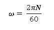

### Procedure
### In real Laboratory

1. Fill up tank with sufficient water  
2. Check free rotation by turning coupling.  
3. Turn on the motor and adjust the RPM to 150. Ensure the spring balance reads zero before starting the motor (for torque measurement).  
4. Measure the Torque required for free rotation of tubes at that RPM. (For measuring the Torque pointer over the toque arm must coincide with the stationary pointer before taking spring balance reading.)  
5. Now start and adjust the flow rate with the help of by-pass valve, so that water does not overflow through central glass tube and also pipes run full water.  
6. Now adjust the speed to previous value and measure the torque.  
7. Note down water flow rate.  
8. Repeat the procedure at different speeds and fill observations in table.  
9. Use the formula to compare Coriolis components of acceleration found theoretical and practical.  

### In simulator

1. Adjust the initial setup parameters using the sliders to calculate the Coriolis components of acceleration.  
2. Lock the experimental setup and click the **Play** button  
3. Click the **Release** button to start the pendulum’s oscillations.  
4. The tabulated results are available for reference once the experiment is completed.  

## Observations:

  

## Calculation:

**Bore Dia. Of tubes = 8mm**  
**Flow area per tube = = 0.0503×10^(-3) m^2** 

**Total flow area (2 tubes) = 0.0001**  

**Flow rate:**  

  

**Therefore, Velocity of water through the tubes, V**  

  

3) **Length of torque arm in meters**  
**Torque T = (spring bal. Difference) x (Kg – m)** 

*The "spring balance difference" is the change in force due to fluid flow (i.e., )*

## Formula Used:

**Theoretical Acceleration Coriolis:**  

  

Where,  
* *v* is the velocity of fluid  
* *ω* is the angular velocity of the system  

  

Here, *N* is the speed of motor  

**By measurements or Practically:**  

  

Where:  
* *g* is the gravitational acceleration constant (9.81 m/s²)  
* *T* is the torque applied to the rotating tubes in kg·m  
* *γ* is the specific weight of water (or the fluid used in the hydraulic model) (1000 kg/m³)  
* *A* is the cross-sectional area of the tube  
* *L* is the effective length of the rotating tube
