### Theory

When a point moves along a line that is simultaneously rotating, its absolute acceleration is the vector sum of three components:

1. The acceleration of a coincident point on the line relative to the fixed rotational center.  
2. The relative acceleration of the moving point with respect to the coincident point.  
3. The third component, called **Coriolis component of acceleration**.

  

Consider a link OA which has a slider B which is free to slide, as shown in Fig. With O as centre, let the link OA move with a uniform angular velocity ω, to its new position OA' such that it is displaced dθ in time dt. The slider B moves outwards with sliding velocity *v* on link OA and occupies the position B' in the same interval of time.

The point C is the coincident point with slider on link OA.

The motion of slider can be explained in the following three stages:

- (i) Motion from C to C' due to rotation of link OA. It is caused by tangential component of acceleration *a′*.
- (ii) Motion from C' to B₁ due to outward motion along the link OA. It is caused by radial component (or sliding component *aᵣ*) of acceleration.
- (iii) Motion from B₁ to B' is caused by Coriolis component of acceleration *a꜀*.
- 
Therefore, from the geometry of the figure:  
Arc B₁B′ = Arc C₁B′ − Arc C₁B₁  
&emsp;&emsp;&emsp;&emsp;&emsp;&emsp;&nbsp;= OC₁(dθ) − OC(dθ)  
&emsp;&emsp;&emsp;&emsp;&emsp;&emsp;&nbsp;= (OC₁ − OC)(dθ)  
&emsp;&emsp;&emsp;&emsp;&emsp;&emsp;&nbsp;= C′B₁ × dθ  .....(i)
\
\
We know that:  

  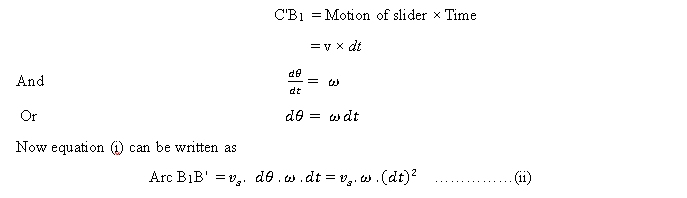

Considering constant acceleration of slider:  

  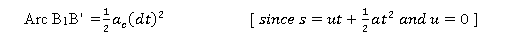

For small θ,  

  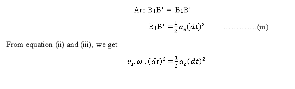

Hence,  
**Coriolis component of acceleration:**

  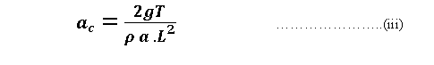

Where,  
- *a꜀* = Coriolis component of acceleration in m/sec²  
- *v* = velocity of sliding in m/sec  
- *ω* = angular velocity in rad/sec of link OA  

---

### Hydraulic Analogy

Consider a short column of fluid of length *dr* at radius *r* from axis of rotation of the tube.  
If velocity of fluid relative to tube is *v*, and angular velocity of tube is *ω*, then Coriolis component of acceleration is **2ωv**.

For a fluid column of length *dr* at radius *r*:

**Force:**

  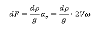

**Torque:**

  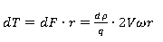

Here, ⅆρ is the weight of the fluid element: ⅆρ= ρa dr
Where:  
- *p* = specific weight (N/m³)  
- *a* = cross-sectional area (m²)

In a direction perpendicular to rotation of tube. 

  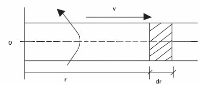

  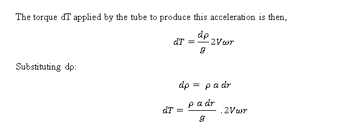

**Total Torque Integration:**  
Integrate from *r = 0* to *r = L* (effective tube length):

  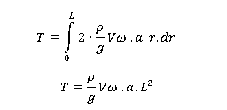

Rearrange the torque equation to solve for *a꜀*:
Hence, Coriolis component of acceleration,

  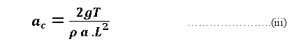

---

### Apparatus

The apparatus uses hydraulic analogy to determine Coriolis' component of acceleration.  
It consists of two brass tubes connected to a central rotor distributor. The distributor is rotated by a variable-speed D.C. motor. Water is supplied to the distributor by a pump through a rotameter.  
When tubes are rotating with water flowing through them, and with various measurements provided, Coriolis’ component can be determined both experimentally and theoretically.

  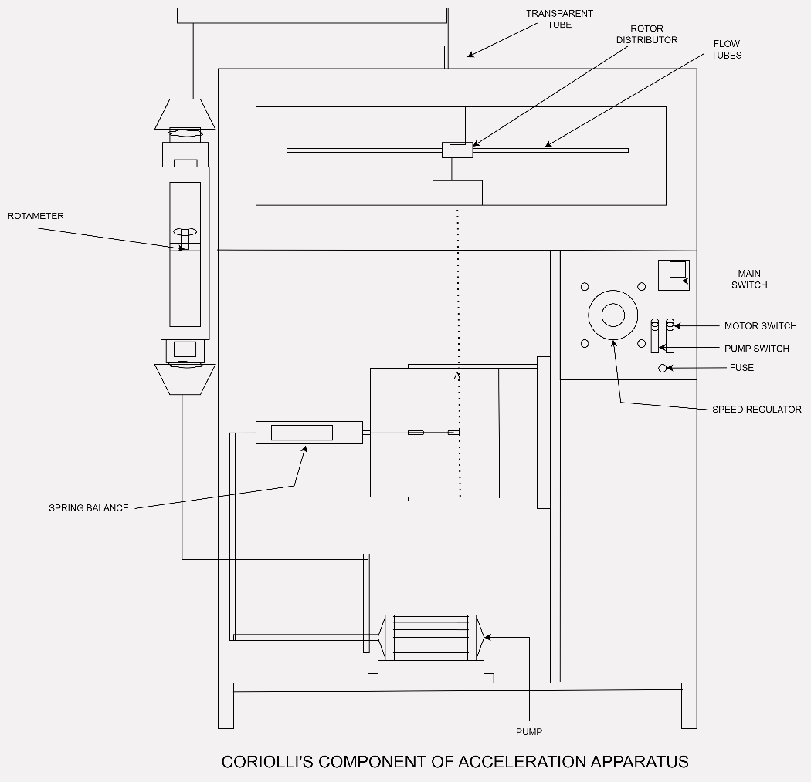

---

### Specifications

1. **Pipes** – 8 mm I.D, 312 mm effective length – 2 Nos.  
2. **Drive motor** – 0.5 HP, 1500 RPM D.C. motor, swinging field type with speed control.  
3. **Torque arm radius** – 0.112 m with 5 kg capacity spring balance.  
4. **Pump** – 0.5 HP capacity, 25 × 25 mm connection, single phase.  
5. **Rotameter**  
6. **Housing** – for rotating pipes, which also acts as water reservoir, with top Perspex sheet.
