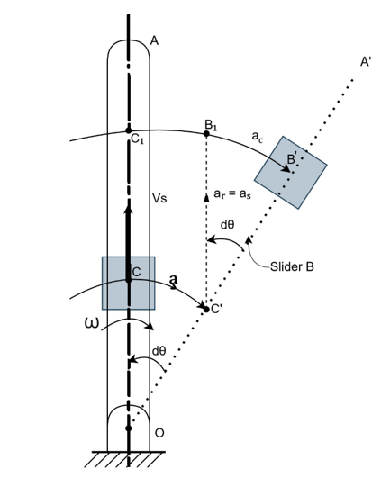
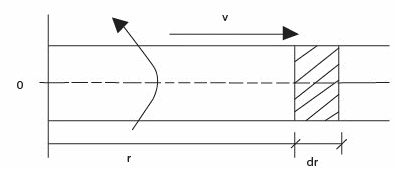
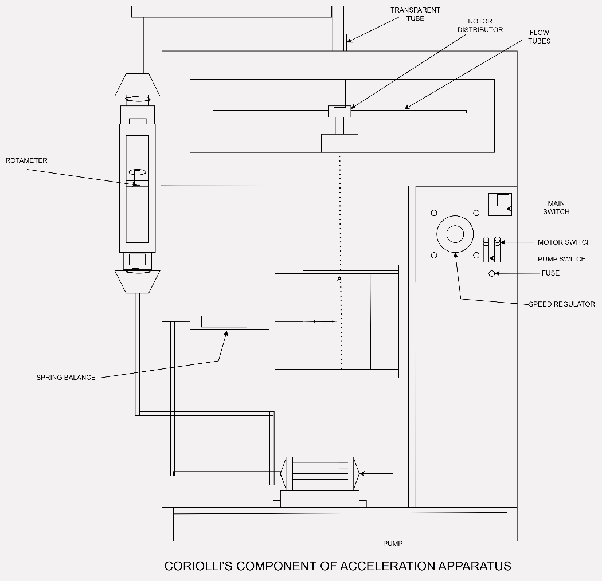

## Theory

When a point (or mass) moves along a line that is simultaneously rotating about a fixed center, its absolute acceleration is the vector sum of three components:

1. **Coincident Point Acceleration ($a_o$):** The acceleration of a coincident point on the rotating link relative to the fixed rotational center (Centripetal/Tangential components).
2. **Relative Acceleration ($a_r$):** The relative acceleration of the moving point with respect to the coincident point (Sliding component).
3. **Coriolis Component of Acceleration ($a_c$):** The additional acceleration component, perpendicular to both the sliding velocity and the angular velocity vector.

Figure 1

### Derivation from Slider Mechanism

Consider a link OA rotating about a fixed point O with a uniform angular velocity $\omega$, and a slider B moving outwards along the link with a sliding velocity $v_s$.

In a small time interval $dt$, the link rotates by a small angle $d\theta$, and the slider moves from position C (at the start of the interval) to B' (at the end of the interval). C' is the coincident point on the new link position OA'.

The total distance traveled by the slider due to Coriolis acceleration (Arc B₁B') is found by comparing the displacement in the tangential direction from the two components of motion:

1. **Displacement due to rotation** from C to C' : $OC \cdot d\theta$
2. **Displacement due to sliding** from C' to B₁ : $v_s \cdot dt$

From the geometry of Fig.,

Arc B₁B' = Arc C₁B' - Arc C₁B₁  
= Arc C₁B' - Arc CC'  
= OC₁($d\theta$) - OC($d\theta$)  
= (OC₁ - OC)$d\theta$  
= CC₁ $d\theta$

$Arc\ B₁B' = C'B₁ \cdot d\theta$

Where:
- $Arc\ B₁B'$ is the displacement caused by the Coriolis acceleration.
- $C'B₁$ is the relative displacement of the slider along the link during time, given by:

$C'B₁$ = Motion of slider × Time  
$C'B₁ = v_s \cdot dt$ .........(1)

- $d\theta$ is the angular displacement of the link during time $dt$. Since the angular velocity $\omega$ is constant:

$\frac{d\theta}{dt} = \omega$  
$d\theta = \omega \cdot dt$ .........(2)

Substituting (1) and (2) into the equation for $Arc\ B₁B'$:

$Arc\ B₁B' = (v_s \cdot dt) \cdot (\omega \cdot dt)$  
$Arc\ B₁B' = v_s\omega(dt)^2$ ...............(3)

Alternatively, the displacement under constant acceleration $a_c$ starting from rest ($u = 0$) is given by $s = ut + \frac{1}{2}at^2$

$Arc\ B₁B' = \frac{1}{2}a_c(dt)^2$ .............(4)

Equating the two expressions for the displacement (3) and (4):

$v_s\omega(dt)^2 = \frac{1}{2}a_c(dt)^2$

This yields the theoretical Coriolis component of acceleration

$\mathbf{a_c = 2\ v_s\omega}$ .............(5)

Where,
- $\mathbf{a_c}$ = Coriolis component of acceleration (m/sec²)
- $\mathbf{v_s}$ = Velocity of sliding (relative velocity) (m/sec)
- $\mathbf{\omega}$ = Angular velocity of link OA (rad/sec)
- $\mathbf{dt}$ = Small time interval (s)
- $\mathbf{d\theta}$ = Small angular displacement

### Hydraulic Analogy and Practical Determination

In the hydraulic analogy, water flows through a rotating tube (link OA) with velocity $V$. The action of the Coriolis acceleration $a_c = 2V\omega$ on the mass of the fluid results in a Coriolis force $dF$. This force generates a net torque $T$ about the center of rotation, which can be measured experimentally.

Figure 2

#### Derivation of Torque $T$

Consider a small element of fluid of length $dr$ at a radius $r$ from the axis of rotation:

1. **Mass of Fluid Element ($dM$):**

$$dM = \frac{\rho}{g} \cdot dV = \frac{\rho a\ dr}{g}$$

Where:
- $\rho$ is the specific weight of the fluid (N/m³ or kgf/m³)
- $a$ is the cross-sectional area of the tube (m²)
- $g$ is the acceleration due to gravity (9.81 m/s²)
- $\frac{\rho}{g}$ is the mass density (kg/m³)

2. **Coriolis Force on the Element ($dF$):**

$$dF = dM \cdot a_c = \frac{\rho a\ dr}{g} \cdot 2V\omega$$

3. **Differential Torque ($dT$):** The torque exerted by the element is the force multiplied by the radius $r$:

$$dT = dF \cdot r = \frac{2\rho aV\omega}{g} \cdot r\ dr$$

4. **Total Torque ($T$):** The total torque is found by integrating the differential torque over the effective length of the tube, $L$ (from $r = 0$ to $r = L$):

$$T = \int_{0}^{L}{dT} = \int_{0}^{L}{\frac{2\rho aV\omega}{g} \cdot r\ dr}$$

Since $\rho,\ a,\ V,\ \omega,\ g$ are assumed constant for the integration:

$$T = \frac{2\rho aV\omega}{g}\int_{0}^{L}{r\ dr} = \frac{2\rho aV\omega}{g} \left[ \frac{r^{2}}{2} \right]_{0}^{L}$$

$T = \frac{\rho aV\omega L^{2}}{g}$ .............(6)

#### Practical Formula for $a_c$

The total torque $T$ is related to $a_c$ (where $a_c = 2V\omega$). Substituting $V\omega = \frac{a_c}{2}$ into equation (6):

$T = \frac{\rho a(a_c/2)L^{2}}{g} = \frac{\rho a\ a_cL^{2}}{2g}$

Rearranging the equation to solve for the **Coriolis component of acceleration** $a_c$:

$\mathbf{a_c = \frac{2gT}{\rho a\ L^{2}}}$ .......................(7)

| Symbol | Definition | Unit |
|--------|------------|------|
| $\mathbf{a_c}$ | Coriolis component of acceleration | ${m/s}^{2}$ |
| $g$ | Acceleration due to gravity | $9.81\ {m/s}^{2}$ |
| $T$ | Total measured torque due to fluid flow | $N \cdot m$ or $kgf \cdot m$ |
| $\rho$ | Specific weight of water | ${kgf/m}^{3}$ |
| $a$ | Cross-sectional area of the tube | $m^{2}$ |
| $L$ | Effective length of the rotating tube | $m$ |
| $V$ | Velocity of fluid flow | $m/s$ |
| $\omega$ | Angular velocity of the tube system | $rad/s$ |

### Apparatus

The apparatus uses hydraulic analogy to determine coriolis component of acceleration. The apparatus consists of two brass tubes connected to a central rotor distributor. The distributor is rotated by a variable speed d.c. motor. Water is supplied to a distributor by a pump through rotameter. When tubes are rotating with water flowing through tubes, with various measurements provided, coriolis component can be determined experimentally and theoretically.

Figure 3

### Specifications

1. **Pipes:** 8 mm I.D., 312 mm effective length - 2 Nos.
2. **Drive motor:** 0.5 HP. 1500 rpm D.C. motor, swinging field type with speed control.
3. **Torque arm:** Radius 0.112 m with 5 kg capacity spring balance.
4. **Pump:** 0.5 H.P capacity 25 x 25 mm connection, single phase.
5. **Rotameter**
6. **Housing for rotating pipes,** which also acts as water reservoir, with top Perspex sheet.

---

